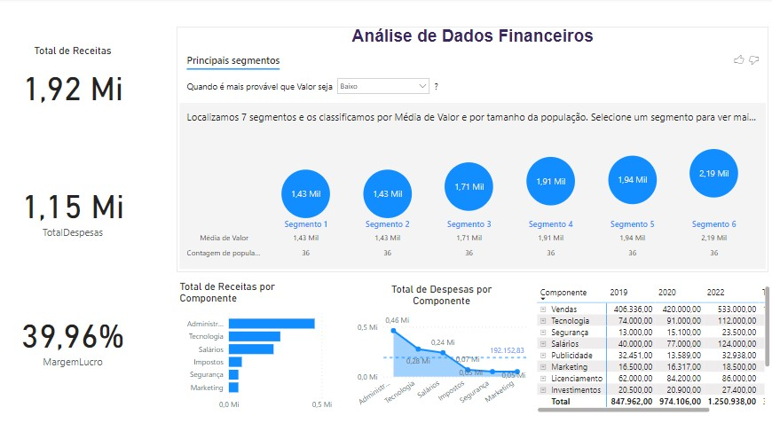
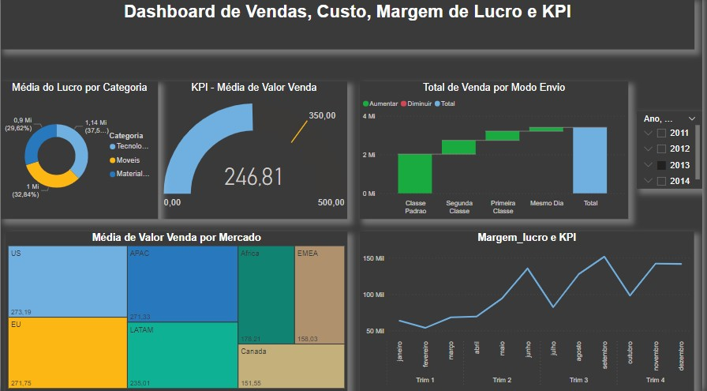

d# 
Projetos em POWERBI

   

  

# Gisleine Moreno
* Gestora da Equipe de Tecnologia da Informação no Grupamento de Apoio de São Paulo na Aeronáutica *

Atuei como gestora da área de tecnologia da informação e comunicação, com habilidades analíticas, capacidade de trabalho em equipe, e atenção aos detalhes dos dados da organização, além de produzir relatórios analíticos e tomar decisões para resolução de problemas. O aprimoramento das minhas habilidades foi acontecendo ao longo dos anos, pois através de estudos e aprendizados, pude aplicar os conhecimentos nas tarefas exercidas durante minha trajetória profissional.

Sou formada em sistemas de informação, com especialidade em Business Inteligence com Big Data na Faculdade Impacta, além de possuir MBA em Inteligência artificial com Data Analytics no ICMC.

**Background in:** PowerBI, Data Analytics, Python, R, Machine Learning.

**Links:**
* [LinkedIn](https://www.linkedin.com/in/gisleinemoreno)

## Projetos em PowerBI:

* [Análise de Dados Financeiros](Dashboard_Financeira.jpg)
  

  
  

* [Análise de Dados Logísticos](Dashboard_Logística.jpg)
* [Análise de Dados Comerciais](Dashboard_Comercial.jpg)
* [Análise de Dados de Recursos Humanos](Dashboard_RH.jpg)
* [Análise de Dados de Marketing](Dashboard_Marketing.jpg)
* [Análise de Dados de Vendas](Dashboard_Vendas.jpg)

  
  

(obs.: Os dados utilizados para produzir os Dashboards, são dados acadêmicos fornecidos pela DSA Academy.
