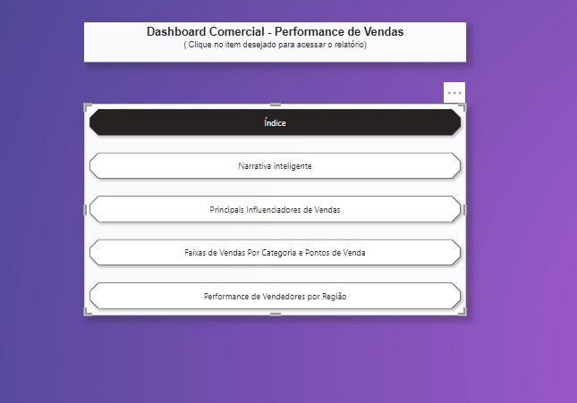

## Projetos em PowerBI:

* [Análise de Dados Financeiros](Dashboard_Financeira.jpg)
  

  
  

* [Análise de Dados Logísticos](Dashboard_Logística.jpg)
  

  
  

* [Análise de Dados Comerciais](Dashboard_Comercial.jpg)
  

  
  

* [Análise de Dados de Recursos Humanos](Dashboard_RH.jpg)
* [Análise de Dados de Marketing](Dashboard_Marketing.jpg)
* [Análise de Dados de Vendas](Dashboard_Vendas.jpg)

  
  

(obs.: Os dados utilizados para produzir os Dashboards, são dados acadêmicos fornecidos pela DSA Academy.
